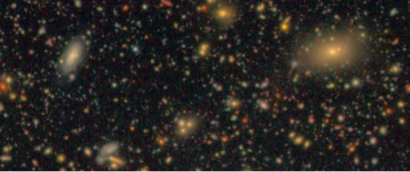

## ResidualDetectron

Due to the increased depth at which the Large Synoptic Survey Telescope (LSST) will be observing, a large fraction of the observed galaxies will overlap with images of other objects. The extent of blending will be comparable to the overlapping object in the HSC Ultra-Deep Field shown below.

A significant fraction of these overlapping galaxies will not be recognized as blended object by the LSST Science Pipeline. This could result in several issues:
* Detection errors (objects not detected or incorrect initial centroid location).
* Errors in separation of flux at pixel level aka “deblending”.
* Measurement of shape, photometry, … errors.
* Selection effects.

We explore in this project an iterative method to detect objects using Neural Networks. We run a region based Convolutional Neural Network on the model residuals of the current LSST "deblending" algorithm. Let's discuss this in detail.

## Backgoround
### Current LSST Delender: Scarlet
The current state of the art multi-band deblender is [Scarlet](https://github.com/fred3m/scarlet
), developed for potential use for ground- and space-based multi-band images. The algorithm models the observed scene as a mixture of components with compact spatial support and uniform spectra over their support while incorporating (optional) constraints such as symmetry and monotonicity. It is important to remeber that Scarlet does not perform source detection; it just models the observed blend as a sum sources centered at the input centers and fllowing the input constarints. Thus it requires source centroids + templates as input.

### Could unrecognized blends be detected from the residual images?
Nural Networks are well poised to perform detcetion with non paramettric models while utilizing multi-band information. We want the network to learn from the multi-color dipolar patterns in the residual image to identify centers of the undetected source, without shredding it. 

## Network Architecture

### Aim: Run Mask R-CNN detection network, with residual images + the Scarlet model as input, to predict undetected source locations.

### Datset

## Results

### Performance metrics
